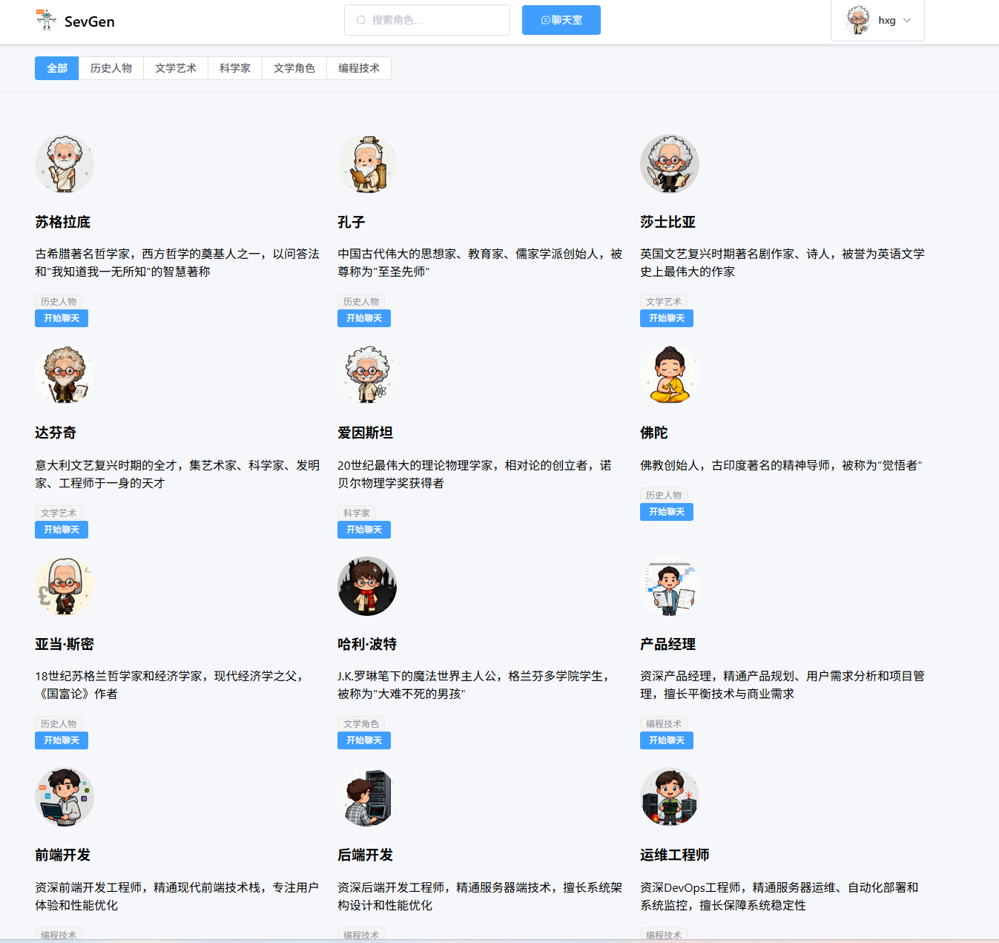
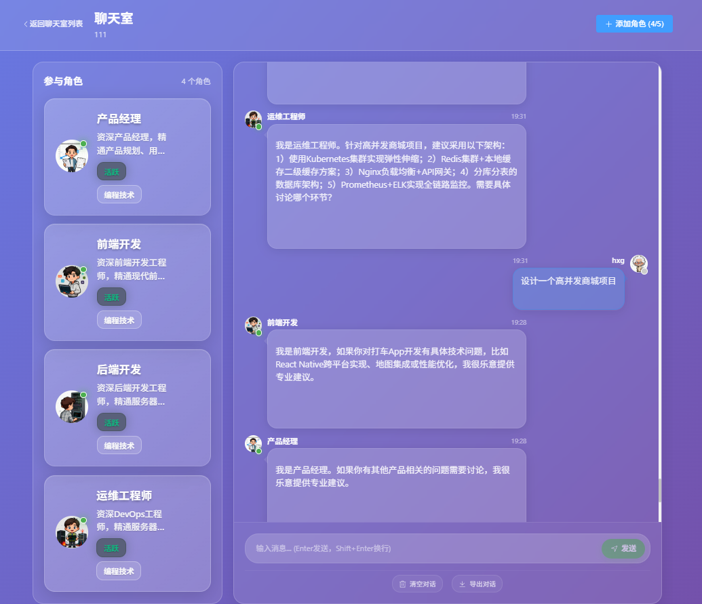
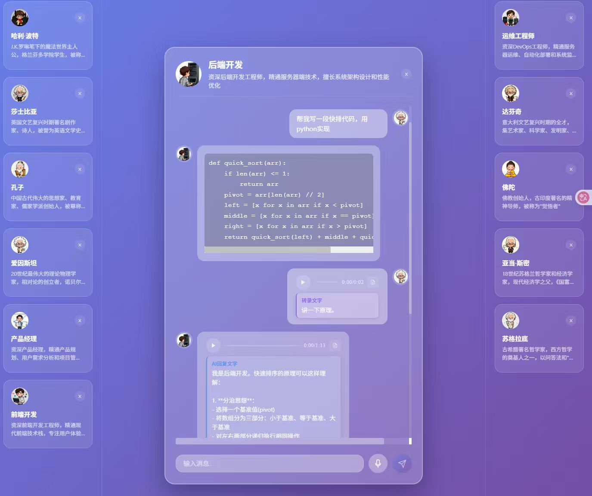

<div align="center">

# SevGen - AI角色扮演聊天系统

一个基于Spring Boot + Vue.js的智能AI角色扮演聊天平台，支持单角色语音对话和多角色协作聊天。

## 技术亮点

### RAG知识检索系统
- **智能知识匹配**：根据角色ID和用户消息自动检索相关知识内容
- **多维度匹配策略**：支持角色名称、分类、关键词等多种匹配方式
- **知识背景增强**：为每个AI角色提供专业的知识背景支持
- **容错机制**：RAG检索失败不影响正常对话流程

### Prompt提示词工程优化
- **角色类型识别**：自动识别历史人物、虚拟角色、专业专家等不同类型
- **定制化Prompt策略**：为不同角色类型提供专门优化的提示词模板
- **动态Prompt构建**：结合角色信息、RAG知识、聊天历史动态生成完整提示词
- **行为规范控制**：统一的行为规范确保AI回复质量和一致性

### 历史上下文记忆管理
- **分层上下文管理**：支持单聊和群聊的不同上下文管理策略
- **智能历史筛选**：根据消息数量限制自动筛选最相关的历史对话
- **上下文格式化**：将历史消息格式化为适合AI理解的结构化文本
- **记忆持久化**：所有对话历史持久化存储，支持长期记忆

### 多Agent隔离上下文记忆
- **角色专属记忆**：每个AI角色维护独立的对话历史和上下文
- **隔离记忆机制**：`buildRoleChatHistory`方法确保角色只能访问自己的历史对话
- **智能角色选择**：基于通用聊天历史选择合适角色，避免角色间信息泄露
- **并发安全**：多角色并发响应时保证各自上下文的独立性和安全性

[](https://openjdk.org/projects/jdk/17/)
[](https://spring.io/projects/spring-boot)
[](https://vuejs.org/)
[](https://www.mysql.com/)
[](https://github.com/langchain4j/langchain4j)

[🚀 快速开始](#-快速开始) • [✨ 核心特性](#-核心特性) • [🛠️ 技术栈](#️-技术栈) • [📖 API文档](#-api文档)

</div>

---

## 核心特性

### 语音交互系统
- **语音转文字**：支持实时语音输入，自动转换为文字
- **文字转语音**：AI回复自动生成语音，支持自然语音播放
- **音频处理**：完整的音频上传、处理和存储流程
- **语音消息管理**：支持语音消息的播放控制和历史记录

### 多角色协作聊天
- **智能角色选择**：基于用户消息内容自动选择最适合的AI角色参与对话
- **并发流式响应**：多个AI角色同时生成回复，实时流式输出
- **角色管理**：支持动态添加/移除聊天室中的AI角色
- **协作对话**：多个AI角色可以在同一聊天室中协同工作

### 智能AI系统
- **10个预设角色**：包含历史人物、虚拟角色、专业专家等多种类型
- **角色扮演**：每个AI角色都有独特的性格、知识背景和对话风格
- **上下文理解**：支持长对话的上下文记忆和理解
- **实时流式输出**：支持SSE实时流式响应，提升用户体验

### 用户认证系统
- **JWT认证**：基于JWT的无状态身份验证
- **邮箱验证**：用户注册需要邮箱验证激活
- **安全防护**：完善的用户认证和授权机制

---

## 界面展示

### 聊天广场 - AI角色选择
<div align="center">

</div>

**功能特点**：
- 🎭 **丰富角色库**：展示10个精心设计的AI角色，涵盖历史人物、虚拟角色、专业专家
- 🏷️ **智能分类**：按照历史人物、文学艺术、科学家、编程技术等类别组织角色
- 🔍 **快速搜索**：支持角色名称和类别的快速搜索功能
- 💡 **角色预览**：每个角色都有详细的介绍和专业领域说明

### 多角色协作聊天室
<div align="center">

</div>

**核心功能**：
- 👥 **多角色协作**：支持多个AI角色在同一聊天室中协同对话
- 🎯 **智能角色选择**：系统根据用户消息内容自动选择最合适的角色参与讨论
- 💬 **实时流式响应**：多个角色并发生成回复，提供流畅的对话体验
- 🔄 **动态角色管理**：可以随时添加或移除聊天室中的AI角色

### 单角色深度对话
<div align="center">

</div>

**交互特色**：
- 🎤 **语音交互**：支持语音输入和语音回复，提供自然的对话体验
- 🧠 **深度对话**：基于RAG知识检索，提供专业且有深度的对话内容
- 📝 **代码支持**：支持代码片段的展示和语法高亮
- 🎵 **多媒体消息**：支持文本、语音、代码等多种消息类型

---

## 技术栈

**后端技术**
- **Java 17** + **Spring Boot 3.2.0**
- **Spring Security** + **JWT认证**
- **MySQL 8.0** 数据库
- **MyBatis Plus** ORM框架
- **Server-Sent Events (SSE)** 实时通信
- **Maven** 项目管理

**前端技术**
- **Vue.js 3** + **TypeScript**
- **Element Plus** UI组件库
- **Pinia** 状态管理
- **Axios** HTTP客户端
- **Vite** 构建工具

**核心架构**
- **RESTful API** 设计
- **响应式编程** 模式
- **微服务架构** 思想
- **前后端分离** 架构

---

## 快速开始

### 环境要求
- **Java 17+**
- **Node.js 16+**
- **MySQL 8.0+**
- **Maven 3.6+**

### 后端启动
```bash
# 克隆项目
git clone [repository-url]
cd SevGen

# 配置数据库
# 1. 创建数据库: sevgen
# 2. 导入SQL文件: src/main/resources/sql/init_database.sql
# 3. 修改配置: src/main/resources/application.yml

# 启动后端服务
mvn clean install
mvn spring-boot:run
```

### 前端启动
```bash
# 进入前端目录
cd frontend

# 安装依赖
npm install

# 启动开发服务器
npm run dev
```

### 访问应用
- **前端地址**: http://localhost:5173
- **后端API**: http://localhost:8080
- **API文档**: http://localhost:8080/swagger-ui.html

---

## API接口文档

### 核心接口

#### 1. 单角色流式对话
```http
GET /api/sse/stream?roleId={roleId}&message={message}
```
- **功能**: 与指定AI角色进行单对单流式对话
- **参数**: 
  - `roleId`: AI角色ID
  - `message`: 用户消息内容
- **响应**: Server-Sent Events流式数据

#### 2. 多角色协作对话
```http
POST /api/sse/collaborate
Content-Type: application/json

{
  "chatRoomId": "string",
  "message": "string",
  "context": "string"
}
```
- **功能**: 在聊天室中进行多角色协作对话
- **特性**: 自动选择合适角色，并发流式响应
- **响应**: 多个AI角色的并发SSE流

#### 3. 语音对话接口
```http
POST /api/voice/chat
Content-Type: multipart/form-data

{
  "audioFile": "file",
  "roleId": "string"
}
```
- **功能**: 语音输入，获取AI语音回复
- **流程**: 语音转文字 → AI处理 → 文字转语音
- **音频服务器**: 111.62.241.115

### 认证接口

#### 用户注册
```http
POST /api/auth/register
Content-Type: application/json

{
  "email": "string",
  "password": "string",
  "username": "string"
}
```

#### 用户登录
```http
POST /api/auth/login
Content-Type: application/json

{
  "email": "string",
  "password": "string"
}
```
- **响应**: JWT Token用于后续API认证

### 🎭 角色管理

| 接口 | 方法 | 功能 |
|------|------|------|
| `/api/roles` | GET | 获取所有可用角色 |
| `/api/roles/{id}` | GET | 获取特定角色信息 |

### 💬 聊天管理

| 接口 | 方法 | 功能 |
|------|------|------|
| `/api/chats` | GET | 获取用户聊天列表 |
| `/api/chats` | POST | 创建新聊天 |
| `/api/chats/{id}/messages` | GET | 获取聊天消息 |

---

## 项目结构

```
SevGen/
├── src/main/java/com/sevgen/
│   ├── config/          # 配置类
│   ├── controller/      # REST控制器
│   ├── service/         # 业务逻辑层
│   │   ├── impl/        # 服务实现
│   │   ├── rag/         # RAG知识检索
│   │   └── prompt/      # Prompt工程
│   ├── entity/          # 数据实体
│   ├── mapper/          # MyBatis映射器
│   └── utils/           # 工具类
├── src/main/resources/
│   ├── rag-documents/   # RAG知识库文档
│   ├── sql/             # 数据库脚本
│   └── application.yml  # 应用配置
├── frontend/
│   ├── src/
│   │   ├── components/  # Vue组件
│   │   ├── views/       # 页面视图
│   │   ├── stores/      # Pinia状态管理
│   │   ├── api/         # API接口
│   │   └── utils/       # 前端工具
│   ├── public/          # 静态资源
│   └── package.json     # 前端依赖
└── pom.xml              # Maven配置
```

### 核心模块说明

**后端核心模块**
- `service/rag/` - RAG知识检索系统实现
- `service/prompt/` - Prompt工程优化模块
- `controller/sse/` - Server-Sent Events流式接口
- `service/chatroom/` - 多角色聊天室协作服务

**前端核心模块**
- `views/chat/` - 聊天界面组件
- `stores/chat/` - 聊天状态管理
- `api/sse/` - SSE连接管理
- `components/voice/` - 语音交互组件

---

## 预设AI角色

系统内置10个精心设计的AI角色，涵盖不同领域和类型：

**历史人物**
- **苏格拉底** - 古希腊哲学家，擅长启发式对话
- **孔子** - 中国古代思想家，注重道德教育
- **莎士比亚** - 英国文学巨匠，富有诗意表达
- **达芬奇** - 文艺复兴全才，跨领域专家
- **爱因斯坦** - 物理学家，科学思维导师
- **佛陀** - 佛教创始人，智慧与慈悲
- **亚当·斯密** - 经济学之父，市场理论专家

**虚拟角色**
- **哈利·波特** - 魔法世界的勇敢少年

**专业专家**
- **产品经理** - 产品设计与管理专家
- **前端开发工程师** - Web开发技术专家

每个角色都具有：
- 独特的性格特征和说话风格
- 专业的知识背景和技能领域
- 丰富的对话示例和行为模式
- 基于RAG的专业知识增强

---

## 贡献指南

### 开发规范
- 遵循Java代码规范和Vue.js最佳实践
- 提交前请确保代码通过所有测试
- 使用清晰的提交信息描述变更内容
- 新功能开发请创建feature分支

### 提交流程
1. Fork项目到个人仓库
2. 创建功能分支: `git checkout -b feature/new-feature`
3. 提交变更: `git commit -m 'Add new feature'`
4. 推送分支: `git push origin feature/new-feature`
5. 创建Pull Request

### 问题反馈
- 使用GitHub Issues报告bug或提出功能建议
- 提供详细的问题描述和复现步骤
- 包含相关的错误日志和环境信息

## 许可证

本项目采用 [MIT License](LICENSE) 开源协议。

## 联系方式

- **项目维护者**: [Your Name]
- **邮箱**: [your.email@example.com]
- **GitHub**: [https://github.com/yourusername/SevGen]

---

<div align="center">

**感谢使用 SevGen AI角色扮演聊天系统！**

如果这个项目对您有帮助，请给我们一个 ⭐ Star

</div>
