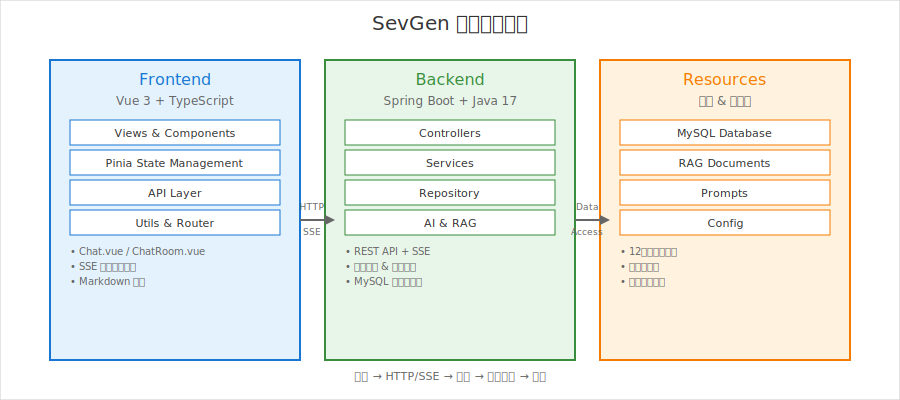
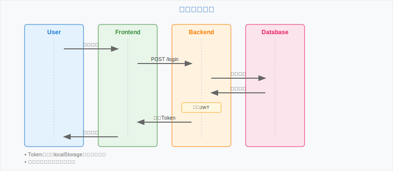
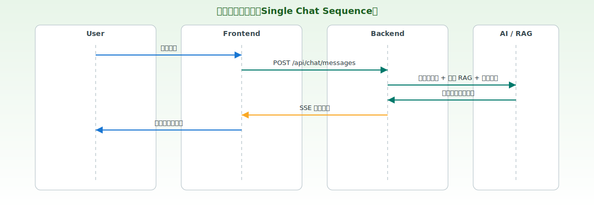
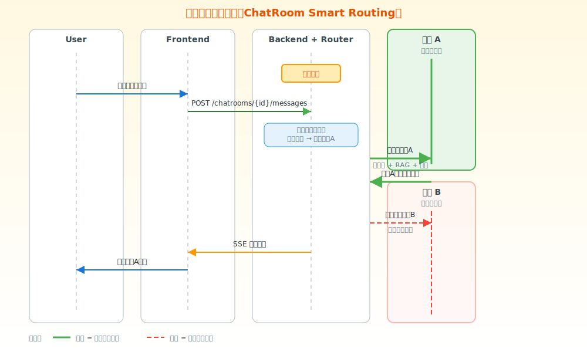

# 架构设计文档
> 面向七牛云招聘评审的架构说明与模块规格文档。我们的小组【小七牛】已完成议题二「AI 角色扮演网站」的端到端实现，本文件聚焦于架构、模块与分工，便于评审快速理解与验证。

---

## 🧭 目录
- [产品愿景](#产品愿景)
- [项目综述](#项目综述)
- [系统架构总览](#系统架构总览)
- [模块与规格](#模块与规格)
  - [前端模块](#前端模块)
  - [后端模块](#后端模块)
  - [数据与资源模块](#数据与资源模块)
  - [AI 与 RAG 模块](#ai-与-rag-模块)
- [用户价值分析](#用户价值分析评审)
  - [一、产品目标合理性](#一产品目标合理性)
  - [二、产品设计合理性](#二产品设计合理性)
  - [三、功能丰富度](#三功能丰富度)
  - [四、是否符合用户需求](#四是否符合用户需求)
  - [✅ 结论](#-结论)
- [核心业务流程](#核心业务流程)
  - [登录鉴权流程](#登录鉴权流程)
  - [单角色对话流程](#单角色对话流程)
  - [群聊/聊天室流程](#群聊聊天室流程)
- [数据模型（概念）](#数据模型概念)
- [非功能性设计](#非功能性设计)
- [质量保障](#质量保障)
- [运行与交付](#运行与交付)
  - [后端运行（Windows）](#后端运行windows)
  - [前端运行（Windows）](#前端运行windows)
  - [构建与打包](#构建与打包)
- [团队分工（3人）](#团队分工3人)
- [提交物与评审指引](#提交物与评审指引)
- [目录索引（节选）](#目录索引节选)
- [版本信息](#版本信息)

---

## 🎯 产品愿景

### 核心理念：深度与广度并重的AI角色扮演生态

**SevGen** 通过「单角色聊天」与「多角色聊天室」两大核心功能，构建了一个完整的AI角色扮演产品生态，满足用户从个人化深度探索到社会化群体智慧的完整需求光谱。

### 🔹 功能一：单角色聊天 —— 深度专注的极致体验
**价值定位**：深度、个性化、隐私性的一对一沉浸式对话

- **无干扰的深度求知**：与"牛顿"专研经典力学，与"王阳明"探讨心学，提供专注的学习环境
- **强烈的情感共鸣**：与"哈利·波特"分享秘密，向"莎士比亚"寻求建议，建立独特的情感纽带  
- **低门槛轻松互动**：流程简单、目标明确，适合初次体验和轻量级娱乐

### 🔹 功能二：多角色聊天室 —— 广度碰撞的高效引擎
**价值定位**：广度、动态博弈、协同效率的多维度智慧碰撞

- **从单一视角到全局视野**："哲学聊天室"中苏格拉底、柏拉图、尼采的跨时空论战，拓宽思维边界
- **从静态问答到动态模拟**："开发聊天室"中产品经理、工程师的立场讨论，预见项目挑战
- **从低效重复到高效协同**：一次性集成多专业视角，提供结构化的"虚拟评审"

### 🎪 功能互补性：相辅相成的产品矩阵
- **需要深度时** → 单角色聊天进行专注探索
- **需要广度时** → 多角色聊天室激发创新思维
- **覆盖全谱**：从个人情感陪伴到专业决策支持的完整服务链条

---

## 📌 项目综述
- 议题：开发一个利用 AI 做角色扮演的网站，支持角色搜索、文字/语音聊天、多角色协作（群聊）。
- 目标：提供沉浸式角色扮演体验，保证角色一致性、回复质量与稳定性。
- 技术栈：
  - 前端：Vue 3 + Vite + TypeScript + Pinia（状态）
  - 后端：Java 17 + Spring Boot +（持久化/校验/日志等）
  - 数据库：MySQL（脚本位于 `src/main/resources/db/`）
  - AI & RAG：提示词与角色知识库位于 `src/main/resources/prompts/` 与 `src/main/resources/rag-documents/`
  - 实时：SSE 流式响应（前端打字机效果）

---

## 🏗️ 系统架构总览


架构要点：
- **三层分离架构**：Frontend（Vue 3 + TypeScript）、Backend（Spring Boot + Java 17）、Resources（MySQL + 知识库）完全解耦，通过标准化接口通信。
- **前端统一API层**：通过 Pinia 状态管理和 API 封装层处理 HTTP/SSE 通信，集成鉴权、错误处理、Markdown 渲染等横切关注点。
- **后端薄控制器设计**：Controllers 仅负责参数校验和响应格式化，核心业务逻辑聚合在 Services 层，Repository 层专注数据访问。
- **资源文件化管理**：12个AI角色的RAG知识库、提示词模板、安全检测配置均以静态资源形式管理，支持热更新和版本控制。
- **流式响应机制**：采用 SSE（Server-Sent Events）实现 AI 对话的实时流式输出，前端渲染打字机效果，提升用户体验。

---

## 🧱 模块与规格

### 前端模块
- 位置：`frontend/`
- 关键目录：
  - `src/views/`：页面（`Chat.vue`、`ChatRoom.vue`、`Home.vue`、`Login.vue`、`Profile.vue` 等）
  - `src/stores/`：状态（`auth.ts`、`chat.ts`、`chatStore.ts`、`role.ts`）
  - `src/api/`：接口封装（`auth.ts`、`chat.ts`、`chatroom.ts`、`message.ts`、`role.ts`）
  - `src/utils/`：工具（`request.ts`、`markdownUtils.ts`、`markdownWithHighlight.ts`、`dateUtils.ts`）
  - `router/index.ts`：路由与守卫
- 规格要点：
  - API 统一经 `utils/request.ts` 注入 Token/错误处理；视图不直接拼 URL。
  - 需要登录的路由由守卫控制，未授权跳转登录页。
  - Markdown 支持代码高亮；消息时间格式化统一。

### 后端模块
- 位置：`src/main/java/com/aichat/...`
- 常见分层：
  - Controller：鉴权、参数校验、返回统一响应
  - Service：业务聚合（房间、角色、消息、权限、SSE 流）
  - Repository/Mapper：数据访问
  - Domain/DTO/VO：实体与传输对象
- API 面向对象（与前端 `api/*.ts` 对应）：
  - `/api/auth/*`：登录注册、用户信息
  - `/api/roles/*`：角色检索与详情
  - `/api/chat/*`、`/api/messages/*`：会话与消息
  - `/api/chatrooms/*`：聊天室与多角色协作
- 规格要点：
  - 使用校验注解（如 `@Validated`）与统一异常处理；
  - 日志记录关键链路，避免泄露敏感数据；
  - 流式响应采用 SSE，长连接超时与断线重连策略在前端实现。

### 数据与资源模块
- 配置：`src/main/resources/application.yml`（数据库、端口、CORS 等）
- SQL：`src/main/resources/db/`（初始化与迁移脚本，如 `database_schema*.sql`）
- 提示词：`src/main/resources/prompts/`（如反思/角色提示）
- RAG：`src/main/resources/rag-documents/`（按角色分目录的素材）

### AI 与 RAG 模块
- 目标：保证角色一致性与内容质量（反思/约束），结合角色知识库提升准确性。
- 做法：
  - 基础提示词工程 + 角色画像 + 反思提示词；
  - RAG 文档为每个角色提供背景知识，便于检索与情境对齐；
  - 敏感/异常内容检测（身份暴露、技术泄露等关键词集位于 `resources/anomaly-keywords/`）。

---

## 📣 用户价值分析

### 一、产品目标合理性
- 目标定位：
  - 面向对知识型角色与 IP 角色感兴趣的用户（如名人、历史人物、文学/影视角色），提供沉浸式对话与学习/娱乐的结合体验。
  - 支持从单角色深聊到多角色群聊（角色间观点碰撞、协作解题），形成差异化玩法。
- 合理性依据：
  - 行业趋势：AI 对话产品已普及，但稳定高质的「角色扮演 + 知识支撑」仍有空间；RAG+提示工程可显著提升角色一致性与专业度。
  - 议题契合：完全契合议题二要求（角色检索、角色扮演、可语音/文本交互、网站形态）。
- 目标拆解：
  1) 低门槛体验：账号注册/登录后即可选择角色开聊；
  2) 高质量角色还原：通过 prompts 与 RAG 素材强化角色设定与知识边界；
  3) 多角色协作：聊天室内多个角色同时参与，提升可玩性与场景丰富度；
  4) 实时体验：SSE 流式输出，降低等待焦虑，接近对话“打字机”体验。

### 二、产品设计合理性
- 信息架构（IA）：
  - 登录/注册 → 主页（角色浏览/检索）→ 单聊（Chat）→ 群聊（ChatRoom/Detail）→ 用户中心（Profile）。
  - 前端路由清晰，登录态由状态管理控制受限页面访问，避免无效跳转与 401 抖动。
- 交互与体验：
  - 流式响应（SSE）呈现逐字输出，显著优化等待体验；
  - Markdown + 代码高亮，便于知识型或技术型角色输出结构化内容；
  - 时间显示统一格式化，消息列表滚动与空态/错误提示可读性较好（从 utils 与 views 结构推断）。
- 一致性与质量保证：
  - 基于 prompts 与角色 RAG 文档，限制模型风格与知识范围，提升角色一致性；
  - 资源层具备异常关键词库（anomaly-keywords），用于自检/提醒（身份暴露、技术泄露、角色破格）。
- 架构合理性：
  - 前后端分离，前端统一请求封装与鉴权；
  - 后端分层清晰（Controller/Service/Repository + 资源层），可维护与可扩展性良好；
  - SQL 脚本分离，资源（prompts、rag-documents）独立可迭代。

### 三、功能丰富度
- 账号与权限：
  - 登录/注册、鉴权状态持久化与路由守卫，支持用户中心（Profile）。
- 角色能力：
  - 角色列表/检索（前端 api/role.ts，资源 rag-documents/ 按角色分门类），头像素材与文档支撑；
  - 角色详情与进入对话（视图 Home/Chat/ChatRoom*）。
- 对话能力：
  - 单角色对话（Chat.vue）；
  - 聊天室/群聊（ChatRoom.vue、ChatRoomDetail.vue），多角色并发响应；
  - SSE 流式展示（更好的实时反馈）。
- 消息与展示：
  - 历史消息加载、Markdown 渲染与代码高亮；
  - 统一时间格式与基础错误处理（utils）。
- 资源与质量：
  - prompts/ 与 rag-documents/ 提供丰富角色语料；
  - anomaly-keywords/ 进行内容异常的关键词辅助检测。

### 四、是否符合用户需求
- 用户画像 A：角色粉丝/泛娱乐用户
  - 需求：轻松与喜欢的角色互动、输出“像他/她会说的话”。
  - 满足点：角色检索 → 单聊/群聊 → 流式输出，角色一致性由 prompts+RAG 保障。
- 用户画像 B：学习者/知识型用户
  - 需求：向名人/专家型角色提问，获得结构化、可读的知识回复。
  - 满足点：Markdown+高亮，RAG 支撑的专业回答；可引入多角色进行正反辩论或多视角解析。
- 用户画像 C：创作/产品原型验证者
  - 需求：把多角色当作头脑风暴“搭子”，快速得到灵感或草案。
  - 满足点：聊天室并发角色响应，观点汇聚更高效。

场景覆盖与合理性：
- 新手路径清晰：注册→选角→开聊；
- 核心链路完整：单聊/群聊/历史消息；
- 内容可控：异常关键词、提示词约束，降低越界风险；
- 可扩展：可按用户反馈引入语音、收藏/分享对话、角色订阅等增值功能。


### ✅ 结论
- 目标合理：紧贴议题与用户价值，强调“角色一致性 + 可玩性 + 学习性”。
- 设计合理：信息架构明确、流式交互顺滑、质量有机制保障（prompts+RAG+关键词）。
- 功能充足：账号/角色/单聊/群聊/历史/Markdown/资源支撑，形成可验证的最小可用闭环（MVP+）。
- 需求匹配：覆盖娱乐/学习/创作三类画像，具备向语音、收藏、分享、订阅等方向扩展的潜力。

---

## 🔄 核心业务流程


### 登录鉴权流程

>  

### 单角色对话流程




### 群聊/聊天室流程




---

## 🗃️ 数据模型（概念）
- 用户 User：`id, username, email, passwordHash, avatar, createdAt ...`
- 角色 Role：`id, name, description, avatar, prompts, category, isPublic ...`
- 会话 Chat/ChatRoom：`id, userId, roleId/chatRoomId, title, isActive ...`
- 消息 Message：`id, chatId/chatRoomId, sender(user/ai), roleId, content, createdAt ...`
- 说明：以 `resources/db/` 中的 SQL 为准；部分环境下存在简化/完整两套 schema（`database_schema_simple.sql` / `database_schema_complete.sql`）。

---

## 🔐 非功能性设计
- 安全：
  - 前端仅以受控方式持久化 Token；
  - 后端对受限接口做鉴权与参数校验；
  - 日志不打印敏感信息；
  - 关键字过滤与合规提示（`resources/anomaly-keywords/`）。
- 性能与扩展：
  - 前端懒加载与最小化请求；
  - 后端服务层无状态，可水平扩展；
  - 可引入缓存（如 Redis）优化热门角色与房间列表。
- 稳定性：
  - 流式超时与断线重连；
  - 服务异常的降级与错误提示；
  - 数据库迁移脚本幂等执行。

---

## 🧪 质量保障
- 代码规范：TypeScript 严格模式；Java 遵循统一检查规范。
- 单元/集成测试：后端在 `src/test/java`；前端可结合 `vitest`（可选）。
- 接口契约：前端通过 `api/*.ts` 封装，避免散落的 URL 与重复逻辑。
- 可观测性：关键路径打日志，定位问题快速回溯。

---

## 🚀 运行与交付

### 后端启动
```bash
# 克隆项目
git clone [repository-url]
cd SevGen

# 配置数据库
# 1. 创建数据库: qiniuyun
# 2. 导入SQL文件: src/main/resources/sql/init_database.sql
# 3. 修改配置: src/main/resources/application.yml

# 启动后端服务
mvn clean install
mvn spring-boot:run
```

### 前端启动
```bash
# 进入前端目录
cd frontend

# 安装依赖
npm install

# 启动开发服务器
npm run dev
```


### 访问应用
- **前端地址**: http://localhost:5173
- **后端API**: http://localhost:16999
- **API文档**: http://localhost:16999/swagger-ui.html


## 👥 团队分工（3人）
- 成员 孙仕勋
  - 负责信息架构、视图搭建、状态管理、鉴权与接口联调；
  - 主要目录：`frontend/views`、`frontend/stores`、`frontend/api`、`frontend/utils`。
- 成员 胡兴广
  - 负责接口设计、服务层实现、数据库脚本、SSE 流与日志/异常处理；
  - 主要目录：`src/main/java/...`、`src/main/resources/db`、`src/main/resources/application.yml`。
- 成员 李泽甫
  - 负责提示词与 RAG 素材管理、质量检测与反思、构建与部署文档、演示环境；
  - 主要目录：`src/main/resources/prompts`、`src/main/resources/rag-documents`、测试/脚本与演示数据。

---

## ✅ 提交物与评审指引
- 提交物（与评审要求对齐）：
  1) 全部源代码（前后端分离）；
  2) 运行说明（本节）与环境配置（`application.yml` 示例）；
  3) 架构设计文档（本文件 + `src/main/resources/架构设计文档.md`）；
  4) 模块规格与分工（见上文「模块与规格」「团队分工」）；
  5) Demo 视频（展示登录、单角色情景、群聊流式交互、消息历史等）。
- 评审建议路径：
  - 先读本文件；
  - 按「运行与交付」快速启动；
  - 通过前端 `Chat.vue` 与 `ChatRoom.vue` 体验单聊/群聊；
  - 查阅 `resources/prompts` 与 `rag-documents` 了解角色知识与提示工程；
  - 查看 `resources/db` 了解数据模型脚本；
  - 如需更多细节，可进一步阅读 `frontend/api/*.ts` 与后端控制器/服务实现。

---

## 📁 目录索引（节选）
- 后端资源：
  - `src/main/resources/application.yml`
  - `src/main/resources/db/*.sql`
  - `src/main/resources/prompts/*`
  - `src/main/resources/rag-documents/*`
  - `src/main/resources/anomaly-keywords/*`
- 前端核心：
  - `frontend/src/views/*`
  - `frontend/src/stores/*`
  - `frontend/src/api/*`
  - `frontend/src/utils/*`
  - `frontend/vite.config.ts`

---

## 🗓️ 版本信息
- 文档：architecture-design-qiniu.md（本文件）
- 版本：v1.0（投递版）
- 更新日期：2025-09-28
